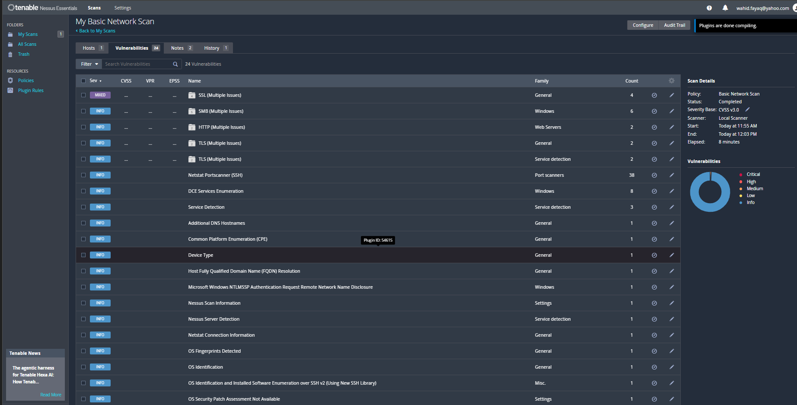
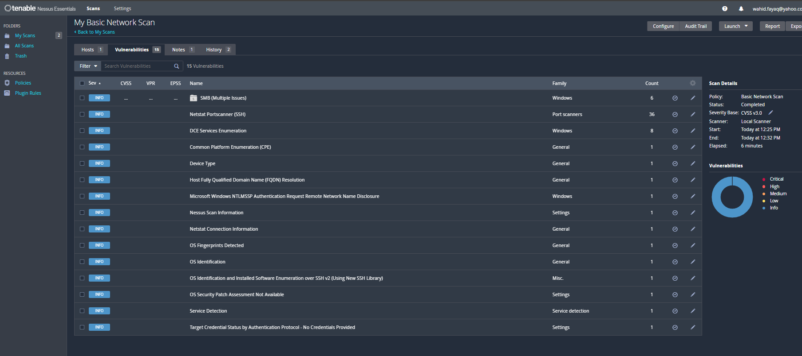

# Vulnerability Assessment and Remediation Report

## Report Summary

On September 24, 2026, an authorized vulnerability assessment was performed against a personal Windows lab computer using Tenable Nessus Essentials 10.12.4.

The baseline scan identified one Medium-severity certificate trust finding associated with the Nessus administration interface. The service was found listening on all IPv4 and IPv6 interfaces.

The Nessus web interface was restricted to localhost, and a verification scan confirmed that the Medium finding was removed.

No confirmed system compromise or malicious activity was identified.

## Environment

- Operating system: Windows 11
- Vulnerability scanner: Tenable Nessus Essentials 10.12.4
- Scan type: Basic Network Scan
- Scan method: Unauthenticated
- Target: Authorized personal computer
- Assessment date: September 24, 2026

## Scope

The assessment was limited to a single authorized Windows computer on a private home network.

The following were outside the assessment scope:

- External systems
- Unauthorized network devices
- Web application penetration testing
- Exploitation
- Password attacks
- Denial-of-service testing

## Baseline Scan Results

The initial scan completed successfully and identified 24 vulnerability groups.

| Severity      |               Findings |
| ------------- | ---------------------: |
| Critical      |                      0 |
| High          |                      0 |
| Medium        |                      1 |
| Low           |            0 confirmed |
| Informational | Remaining observations |

### Evidence



## Medium Finding

### Finding Details

| Field            | Value                                 |
| ---------------- | ------------------------------------- |
| Name             | SSL Certificate Cannot Be Trusted     |
| Plugin ID        | 51192                                 |
| Severity         | Medium                                |
| CVSS v3.0 score  | 6.5                                   |
| Plugin type      | Remote                                |
| Plugin family    | General                               |
| Affected service | Nessus HTTPS administration interface |
| Service port     | TCP 8834                              |

### Description

Nessus detected an X.509 certificate that could not be validated through a publicly trusted certificate authority.

The affected certificate was the self-signed certificate used by the local Nessus administration interface.

In a production environment, an untrusted certificate may make it more difficult for users to verify the identity of a server. This condition could increase exposure to man-in-the-middle attacks if the service is accessed across an untrusted network.

### Context

The Nessus interface was intended only for local administration. However, TCP port `8834` was listening on all available IPv4 and IPv6 network interfaces.

PowerShell showed:

```text
0.0.0.0:8834
[::]:8834
```

The owning executable was confirmed as:

```text
C:\Program Files\Tenable\Nessus\nessusd.exe
```

## Risk Analysis

### Likelihood

Low to Moderate

The service was located on a personal network and protected by the Windows firewall. However, listening on all interfaces created more exposure than was required for local administration.

### Impact

Moderate

An untrusted certificate can prevent reliable server-identity validation. If an attacker could intercept the connection, users might have difficulty distinguishing the legitimate service from an impersonated service.

### Initial Risk Rating

Medium

### Root Cause

The Nessus `listen_address` setting used the default value:

```text
0.0.0.0
```

This caused the Nessus web interface to listen on all IPv4 interfaces. It also listened through IPv6.

## Remediation

The Nessus web server address was changed to:

```text
127.0.0.1
```

The Nessus service was then restarted:

```powershell
Restart-Service "Tenable Nessus"
```

This limited access to the administration interface to local connections originating from the same computer.

## Remediation Validation

PowerShell verified that port `8834` was listening only on localhost:

```text
127.0.0.1:8834
```

The service was no longer listening on:

```text
0.0.0.0:8834
[::]:8834
```

A second Basic Network Scan was performed using the same authorized target.

## Verification Scan Results

| Result               |                Baseline |       Verification |
| -------------------- | ----------------------: | -----------------: |
| Vulnerability groups |                      24 |                 15 |
| Critical findings    |                       0 |                  0 |
| High findings        |                       0 |                  0 |
| Medium findings      |                       1 |                  0 |
| Certificate finding  |                 Present |            Removed |
| Remaining findings   | Mixed and informational | Informational only |

### Evidence



## Outcome

The verification scan no longer detected the untrusted Nessus certificate through the laptop’s network interface.

The remediation successfully:

- Removed the Medium finding.
- Reduced network exposure.
- Limited the administration interface to localhost.
- Reduced the vulnerability groups from 24 to 15.
- Preserved local access through `https://localhost:8834`.

## Residual Risk

Residual risk was assessed as Low within this controlled personal lab.

The self-signed certificate is still used when accessing Nessus locally. However, the interface is no longer exposed through the laptop’s private network address.

For a production or remotely accessed Nessus deployment, a certificate issued by a trusted internal or public certificate authority should be considered.

## Assessment Limitations

The scan was unauthenticated, and no Windows credentials were provided.

As a result, Nessus could not fully evaluate:

- Missing Windows security updates
- Installed software vulnerabilities
- Registry configurations
- Local security policies
- Findings requiring authenticated system access

The remaining informational findings describe detected services and system characteristics. They do not independently confirm exploitable vulnerabilities.

## Recommendations

- Keep the Nessus interface restricted to localhost unless remote administration is required.
- Use a trusted certificate if Nessus must be accessed remotely.
- Keep Nessus plugins and software updated.
- Keep Windows security updates current.
- Maintain Windows Firewall protection.
- Perform authenticated scans only when appropriate credentials and authorization are available.
- Protect raw scan reports because they may contain sensitive system information.
- Periodically repeat scans to identify configuration changes and newly disclosed vulnerabilities.

## Classification

- Initial severity: Medium
- Final severity: Informational only
- Risk treatment: Mitigated
- Remediation status: Verified
- Escalation required: No
- Confirmed compromise: No
- Disposition: Authorized lab activity

## Conclusion

The assessment demonstrated the full vulnerability-management lifecycle: asset scanning, finding analysis, service validation, risk assessment, remediation, and verification.

Restricting the Nessus web interface to localhost removed the Medium certificate finding from the network scan and reduced unnecessary service exposure.
