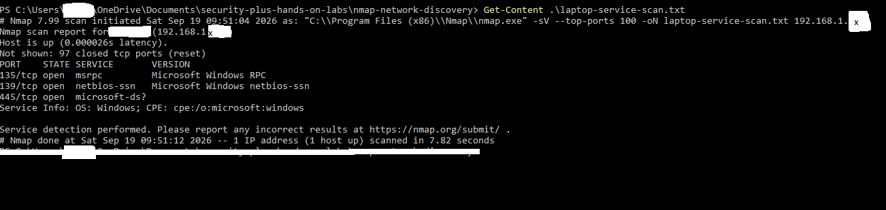
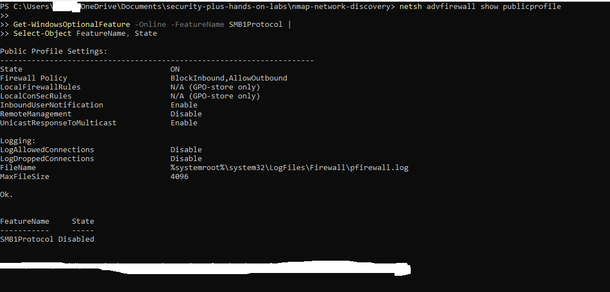

# Nmap Network Discovery and Service Analysis Lab

## Overview

This lab demonstrates how Nmap can be used to discover active devices, identify open ports, investigate listening processes, and evaluate Windows security controls. All scanning was performed on an authorized personal home network.

## Objectives

- Identify the local network range.
- Discover active devices using Nmap.
- Scan a Windows computer for common open ports.
- Identify services and processes using those ports.
- Review Windows Firewall and SMBv1 security settings.
- Document and assess the findings.

## Tools Used

- Windows
- PowerShell
- Nmap 7.99
- Npcap 1.87
- Windows Defender Firewall
- Visual Studio Code

## Network Discovery

The local network used the following private range:

```text
192.168.1.0/24
```

Host discovery was performed with:

```powershell
nmap -sn 192.168.1.0/24 -oN host-discovery.txt
```

### Command Explanation

- `nmap`: starts the Nmap scanner.
- `-sn`: performs host discovery without scanning ports.
- `192.168.1.0/24`: specifies the authorized home-network range.
- `-oN`: saves the results in normal text format.

### Discovery Result

Nmap checked 256 IP addresses and identified eight active hosts. Recognized devices included the router, Windows laptop, Canon device, iPad, and Roku. Several devices used unidentified or randomized MAC addresses.

MAC addresses were excluded from the public documentation for privacy.

## Service Scan

The Windows lab computer was scanned using:

```powershell
nmap -sV --top-ports 100 192.168.1.170 -oN laptop-service-scan.txt
```

### Findings

| Port    | State | Service                 | Purpose                                 |
| ------- | ----- | ----------------------- | --------------------------------------- |
| 135/TCP | Open  | Microsoft RPC           | Windows service communication           |
| 139/TCP | Open  | NetBIOS Session Service | Legacy Windows file and printer sharing |
| 445/TCP | Open  | Microsoft-DS/SMB        | Windows file and printer sharing        |

The remaining 97 scanned TCP ports were closed.



## Process Investigation

PowerShell was used to identify the processes listening on the discovered ports:

```powershell
Get-NetTCPConnection -State Listen |
Where-Object { $_.LocalPort -in 135,139,445 } |
Select-Object LocalAddress, LocalPort, OwningProcess
```

The investigation identified:

- PID 4: Windows System process
- PID 1616: `svchost.exe`
- `RpcEptMapper`: RPC Endpoint Mapper
- `RpcSs`: Remote Procedure Call

The executable path for `svchost.exe` was the legitimate Windows location:

```text
C:\Windows\System32\svchost.exe
```

## Security-Control Review

The active Wi-Fi connection used the Public network profile. Windows Firewall was enabled with the following policy:

```text
BlockInbound,AllowOutbound
```

Remote firewall management was disabled.

The outdated SMBv1 protocol was also checked and found to be disabled:

```text
FeatureName: SMB1Protocol
State: Disabled
```



## Assessment

The discovered services were associated with expected Windows components. No confirmed malicious service was identified.

Open ports do not independently prove that a vulnerability exists. The service, process, firewall configuration, device purpose, and surrounding activity must be considered together.

Because the laptop scanned its own IP address, the results confirm that the services were listening locally. They do not independently prove that another network device could reach those ports. The Public firewall profile should block unsolicited inbound connections unless an allow rule exists.

## Recommendations

- Keep Windows Firewall enabled.
- Keep SMBv1 disabled.
- Install Windows security updates regularly.
- Disable file and printer sharing when it is unnecessary.
- Review unknown devices through the router’s management interface.
- Consider enabling firewall logging for additional monitoring.
- Never expose SMB ports directly to the public internet.

## Incident Report

For the complete investigation and risk assessment, see the [Nmap Network Discovery Incident Report](incident-report.md).

## Skills Demonstrated

- Network discovery
- Nmap host and service scanning
- TCP port analysis
- Windows process investigation
- Windows Firewall review
- SMB security assessment
- Security-event documentation

## Ethical Use

All activity was performed on an authorized personal network and computer. No external or unauthorized systems were scanned.
