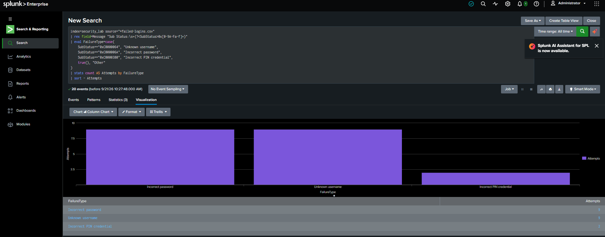
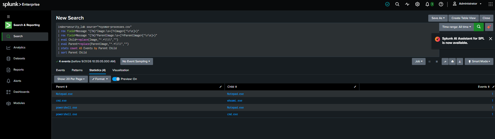

# Splunk SIEM Log Analysis Report

## Report Summary

On September 21, 2026, Windows Security and Sysmon event data was imported into Splunk Enterprise and analyzed using Splunk Processing Language (SPL).

The investigation examined 20 failed authentication events and four process-creation events. The activity was generated on an authorized personal computer as part of a controlled cybersecurity lab.

No confirmed malicious activity was identified.

## Environment

- Operating system: Windows 11
- SIEM platform: Splunk Enterprise 10.4.3
- Endpoint-monitoring tool: Microsoft Sysmon 15.22
- Splunk index: `security_lab`
- Source type: `csv`
- Host label: `windows-lab`
- Authorization: Personal lab environment

## Data Sources

| Source                 | Event type            | Events |
| ---------------------- | --------------------- | -----: |
| `failed-logins.csv`    | Windows Event ID 4625 |     20 |
| `sysmon-processes.csv` | Sysmon Event ID 1     |      4 |
| **Total**              |                       | **24** |

## Finding 1: Failed Authentication Attempts

All 20 Windows Security events used Event ID `4625`, indicating failed logon attempts.

The authentication sub-status codes were extracted and grouped using SPL.

### Results

| Failure type             | Sub-status   | Attempts |
| ------------------------ | ------------ | -------: |
| Unknown username         | `0xC0000064` |        9 |
| Incorrect password       | `0xC000006A` |        9 |
| Incorrect PIN credential | `0xC0000380` |        2 |

### Assessment

The failed logins were generated during authorized lab activity. No evidence independently confirmed password spraying, brute-force activity, or unauthorized access.

In a production environment, repeated failures could require investigation, especially when they involve:

- Numerous accounts from one source
- Repeated attempts against one account
- Unusual source addresses or locations
- Failures followed by a successful login
- Activity occurring outside expected working hours

### Evidence

## Finding 2: Sysmon Process Creation

Four Sysmon Event ID `1` records were analyzed to determine which programs were executed and which parent processes launched them.

### Results

| Parent process   | Child process | Events |
| ---------------- | ------------- | -----: |
| `powershell.exe` | `Notepad.exe` |      1 |
| `Notepad.exe`    | `Notepad.exe` |      1 |
| `powershell.exe` | `cmd.exe`     |      1 |
| `cmd.exe`        | `whoami.exe`  |      1 |

### Assessment

The observed processes were legitimate Windows applications intentionally executed during the lab.

The `cmd.exe → whoami.exe` activity was classified as security-relevant because `whoami` performs account discovery. Administrators commonly use this command, but attackers may also use it after compromising a system to determine which account they control.

The activity would become more suspicious if it followed:

- An unexpected email attachment
- An encoded PowerShell command
- Execution from a temporary or user-download directory
- An unusual remote login
- Malware execution
- An unexpected external network connection

### Evidence

## Correlation and Analysis

Splunk made it possible to search, extract, group, and visualize information from multiple Windows data sources.

The authentication events showed failed access attempts, while the Sysmon events showed endpoint process activity. No direct relationship between the two datasets was established during this investigation.

This demonstrates why analysts should not classify an event as malicious based only on an event ID or executable name. Additional context and correlation are required.

## Classification

- Severity: Informational
- Classification: Benign
- Disposition: Authorized lab activity
- Escalation required: No
- Confirmed compromise: No

## Recommended Actions

If similar activity appeared unexpectedly in a production environment, a SOC analyst should:

- Identify the affected users and computers.
- Review the source addresses and logon types.
- Check whether a successful login followed the failures.
- Examine the complete parent-child process chain.
- Review the associated command lines.
- Search for related network connections.
- Check for new files, services, registry changes, or scheduled tasks.
- Compare executable hashes with trusted threat-intelligence sources.
- Escalate the activity if multiple suspicious indicators are correlated.

## Privacy and Evidence Handling

The raw CSV files were excluded from the public GitHub repository because they may contain usernames, computer names, security identifiers, and local file paths.

Only sanitized aggregate results were included as public evidence.

## Conclusion

Splunk Enterprise successfully ingested and analyzed the Windows Security and Sysmon datasets. SPL searches identified three authentication-failure categories and four parent-child process relationships.

The activity was determined to be authorized and benign. The lab demonstrated practical skills in SIEM data ingestion, SPL searching, field extraction, event correlation, visualization, triage, and incident documentation.
