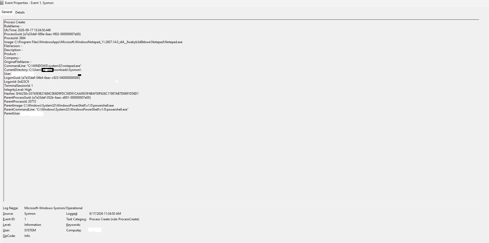
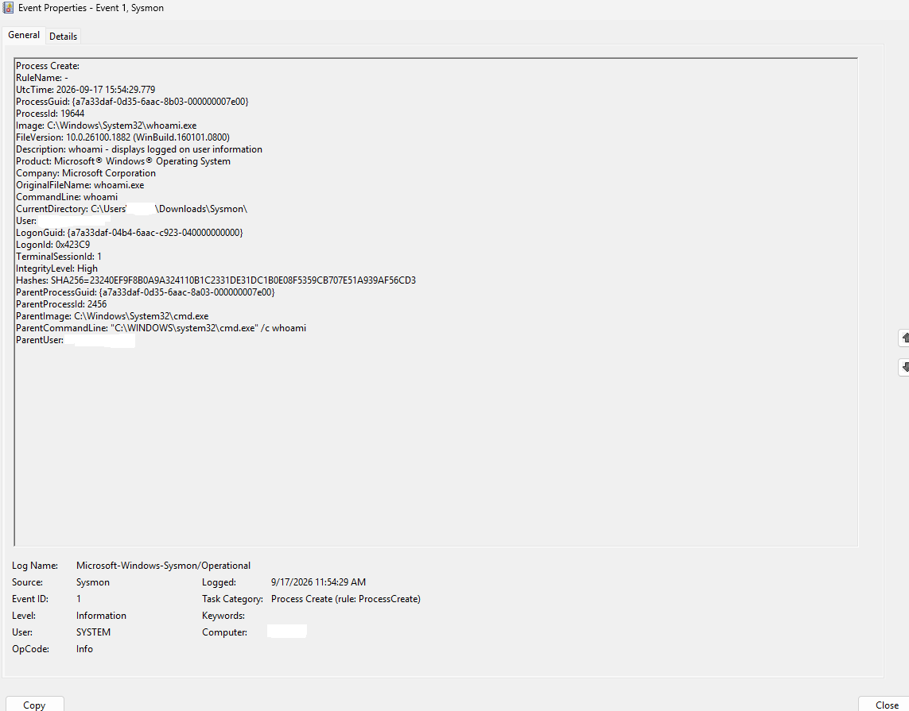

# Sysmon Endpoint Monitoring Lab

## Overview

This lab demonstrates how to install Microsoft Sysmon, collect endpoint telemetry, and investigate Windows process-creation events. Two controlled activities were analyzed: launching Notepad from PowerShell and running the `whoami` account-discovery command.

## Objectives

- Install and verify Microsoft Sysmon.
- Generate controlled process activity.
- Investigate Sysmon Event ID 1.
- Analyze command lines and parent-child process relationships.
- Calculate and review executable hashes.
- Distinguish suspicious indicators from confirmed malicious activity.

## Tools Used

- Windows 11
- Microsoft Sysmon 15.22
- Windows Event Viewer
- PowerShell
- Command Prompt
- Visual Studio Code

## Installation

The built-in Windows Sysmon feature was initially enabled, but its executable was unavailable. The incomplete feature was disabled before installing the standalone Microsoft Sysinternals version to prevent a conflict.

The standalone executable's Microsoft digital signature was verified before installation.

```powershell
.\Sysmon64.exe -accepteula -i
Get-Service sysmon*
```

The `Sysmon64` service was confirmed to be running.

## Test 1: Notepad Process Creation

Notepad was launched from PowerShell:

```powershell
Start-Process notepad.exe
```

Sysmon recorded Event ID 1 and identified PowerShell as the parent process.

```text
powershell.exe → notepad.exe
```

### Findings

- Event ID: 1 — Process Create
- Image: Notepad.exe
- Parent image: powershell.exe
- Integrity level: High
- Hash algorithm: SHA-256
- Result: Authorized and benign activity



## Test 2: Account-Discovery Activity

The following controlled command identified the current user:

```powershell
cmd.exe /c whoami
```

Sysmon recorded this process chain:

```text
powershell.exe → cmd.exe → whoami.exe
```

### Findings

- Event ID: 1 — Process Create
- Image: whoami.exe
- Command line: whoami
- Parent image: cmd.exe
- Parent command line: cmd.exe /c whoami
- Integrity level: High
- Result: Authorized lab activity with behavior resembling account discovery



## Analysis

Neither event independently proves malicious activity. Notepad, PowerShell, Command Prompt, and `whoami` are legitimate Windows tools. However, attackers may abuse legitimate programs during discovery and execution.

A SOC analyst would examine the parent process, command line, user, file hash, network connections, timing, and related events. An unexpected `whoami` command following a phishing document, encoded PowerShell command, or unknown network connection would require further investigation.

## Security Significance

Sysmon provides detailed endpoint telemetry but does not determine whether activity is malicious. Logs can be forwarded to a SIEM platform, where detection rules correlate multiple events and generate alerts for SOC analysts.

## Incident Report

See the complete [endpoint activity analysis report](incident-report.md).

## Skills Demonstrated

- Sysmon installation and verification
- Windows endpoint monitoring
- Event ID 1 analysis
- Parent-child process analysis
- Command-line investigation
- SHA-256 hash review
- Security-event triage
- Technical documentation

## Ethical Use

All activity was performed on an authorized personal computer in a controlled lab environment.
