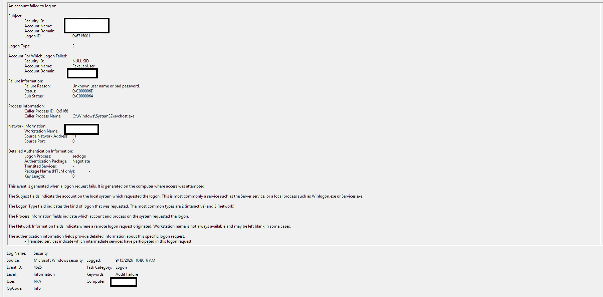

# Windows Failed-Login Detection Lab

## Overview

This lab demonstrates how to generate, detect, and investigate failed Windows authentication attempts using Windows Event Viewer. The activity was performed in a controlled environment on an authorized Windows 11 computer.

## Objective

- Generate controlled failed-login attempts.
- Locate authentication failures in Windows Security logs.
- Analyze Event ID 4625.
- Identify important authentication fields and status codes.
- Recommend controls for reducing unauthorized-access risks.

## Tools Used

- Windows 11
- Windows PowerShell
- Windows Event Viewer
- Visual Studio Code

## Lab Scenario

Three failed-login attempts were generated for a nonexistent test account named `FakeLabUser` using the Windows `runas` command.

```powershell
runas /user:FakeLabUser cmd.exe
```

## Investigation Findings

| Field | Finding |
| Event ID | 4625 |
| Target account | FakeLabUser |
| Logon type | 2 — Interactive login |
| Failure reason | Unknown username or bad password |
| Status | 0xC000006D |
| Sub-status | 0xC0000064 |
| Source address | ::1 — Local IPv6 loopback |
| Authentication package | Negotiate |

The sub-status code `0xC0000064` indicates that the requested username did not exist. The source address `::1` confirms that the request originated from the local computer.

## Security Significance

Repeated Event ID 4625 records may indicate:

- User password mistakes
- Password guessing
- Brute-force attacks
- Password-spraying attacks
- Incorrectly configured applications or services

Security analysts should examine the targeted account, source address, time pattern, failure reason, and whether a successful login occurred after the failures.

## Recommended Security Controls

- Enable multifactor authentication.
- Configure an appropriate account-lockout policy.
- Monitor repeated authentication failures.
- Enforce strong password requirements.
- Alert on failures followed by successful authentication.
- Forward authentication logs to a SIEM platform.

## Evidence



## Incident Report

See the complete [incident report](incident-report.md).

## Skills Demonstrated

- Windows security-log analysis
- Authentication-event investigation
- Event ID and status-code interpretation
- Incident documentation
- Security-control recommendations

## Disclaimer

This activity was performed only on an authorized personal computer in a controlled lab environment.
