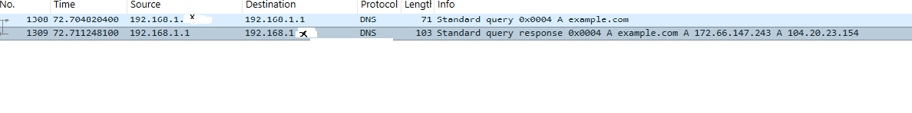
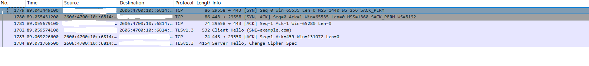

# Wireshark Network Traffic Analysis Lab

## Overview

This lab demonstrates how Wireshark can capture and analyze DNS, TCP, and TLS traffic. Controlled traffic was generated to `example.com` on an authorized personal Windows computer.

## Objectives

- Capture network traffic from a Wi-Fi interface.
- Analyze a DNS query and response.
- Identify a TCP three-way handshake.
- Examine a TLS 1.3 negotiation.
- Understand what information remains visible in encrypted traffic.
- Protect sensitive packet-capture data.

## Tools Used

- Windows 11
- Wireshark 4.6.7
- Npcap 1.87
- PowerShell
- Visual Studio Code

## Traffic Generation

The DNS cache was cleared to force a new lookup:

```powershell
ipconfig /flushdns
```

A controlled DNS request was generated:

```powershell
nslookup example.com
```

An HTTPS request was then generated:

```powershell
curl.exe -I https://example.com
```

The `-I` option requested only the HTTP response headers.

## DNS Analysis

The following Wireshark display filter isolated the DNS transaction:

```text
dns.id == 0x0004
```

The client sent an IPv4 address request for `example.com` to the local DNS server. The response returned two IPv4 addresses:

```text
172.66.147.243
104.20.23.154
```

The DNS response arrived approximately 6.4 milliseconds after the query.



## TCP Three-Way Handshake

Packets 1779 through 1781 showed the TCP connection establishment:

| Packet | Direction        | TCP Flags | Meaning                               |
| ------ | ---------------- | --------- | ------------------------------------- |
| 1779   | Client to server | SYN       | Requested a connection                |
| 1780   | Server to client | SYN, ACK  | Accepted and acknowledged the request |
| 1781   | Client to server | ACK       | Confirmed the connection              |

The client used temporary port `29558` to connect to the server’s HTTPS port `443`. The handshake completed in approximately 12.2 milliseconds.

## TLS Analysis

After the TCP connection was established, TLS 1.3 negotiation began:

| Packet | Event        | Meaning                      |
| ------ | ------------ | ---------------------------- |
| 1782   | Client Hello | Client proposed TLS settings |
| 1784   | Server Hello | Server selected TLS settings |

The Client Hello contained:

```text
SNI=example.com
```

The HTTPS content was encrypted, but the requested domain remained visible through the Server Name Indication field in this capture.



## Analysis

The observed sequence was:

```text
DNS resolution → TCP handshake → TLS negotiation → Encrypted HTTPS traffic
```

The activity was expected and authorized. No suspicious destinations, unusual ports, or malformed connection behavior were identified.

A security analyst could use the same techniques to investigate:

- Connections to suspicious domains
- Repeated or unusual DNS requests
- Unexpected external IP addresses
- Abnormal connection attempts
- Unencrypted traffic
- Failed or unusual TLS negotiations

## Privacy Protection

The raw packet capture may contain network identifiers and was excluded from Git using:

```gitignore
*.pcap
*.pcapng
```

Personal IPv4, IPv6, MAC, and interface identifiers were removed from the published evidence.

## Incident Report

For complete findings and assessment, see the [Wireshark Network Traffic Analysis Report](incident-report.md).

## Skills Demonstrated

- Packet capture and analysis
- Wireshark display filtering
- DNS transaction analysis
- TCP three-way handshake analysis
- TLS 1.3 handshake analysis
- Network-traffic triage
- Evidence handling and privacy protection
- Technical documentation

## Ethical Use

All traffic was generated and captured on an authorized personal computer and network. No unauthorized traffic was intercepted.


